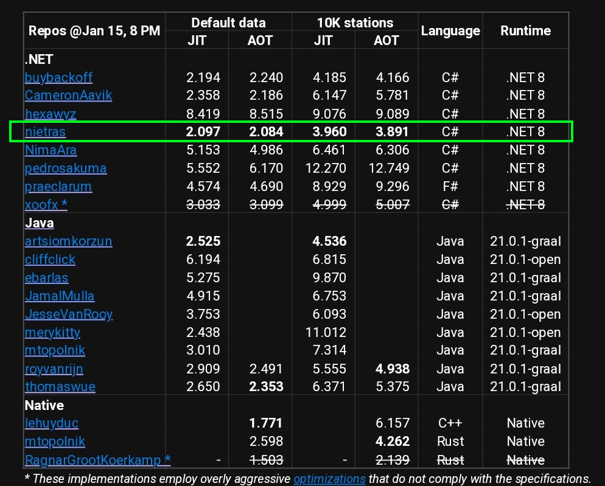
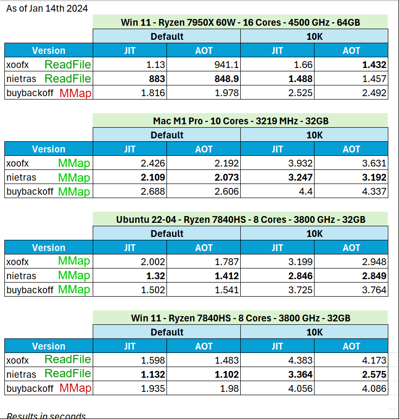
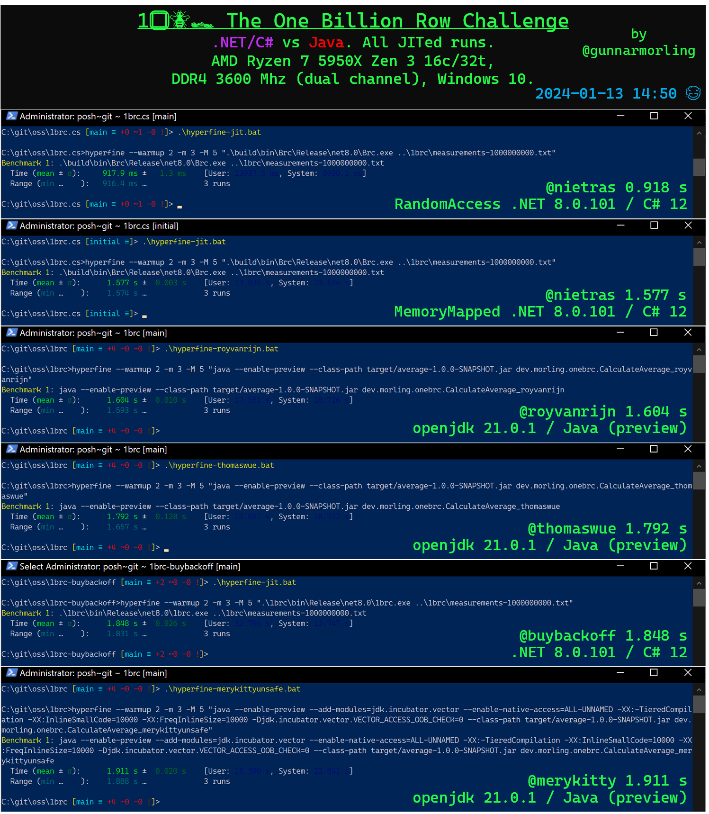

# 1️⃣🐝🏎️ The One Billion Row Challenge -- C# Edition -- nietras


[](https://github.com/nietras/1brc.cs/actions/workflows/dotnet.yml)


* See https://github.com/gunnarmorling/1brc for original Java challenge.
* See https://huggingface.co/datasets/nietras/1brc.data for data only.

For command line process start/stop measurement
https://github.com/sharkdp/hyperfine is used. This can be installed with
Chocolatey (or WinGet):
```
choco install hyperfine
```

2024-01-15 (comparison by @buybackoff see https://hotforknowledge.com/2024/01/13/7-1brc-in-dotnet-even-faster-than-java-cpp/#results)


2024-01-14 (comparison by @xoofx see https://mastodon.social/@xoofx/111755470365432385 note ~800 are in ms)


2024-01-13 (comparison by me)


## Data Statistics for One Billion Row Challenge
1BRC numbers for 1B rows data file. 413 station names. Length = Unique Count.
```
 3 =  2
 4 = 18
 5 = 42
 6 = 87
 7 = 66
 8 = 57
 9 = 47
10 = 26
11 = 26
12 = 17
13 =  9
14 =  4
15 =  2
16 =  6
17 =  1
18 =  1
24 =  1
26 =  1
```
Note how all lie within first 32 bytes. Optimise for that. Only 4/413 are longer
than 16 bytes, so 1% only. Optimize for that. Keep in mind length=16 cannot be
found by Vector128. In any case, doing one Vector256 search is faster than two
Vector128 searches. 32 - 26 = 6. Longest number is `-99.9` or 5 bytes so most
line endings will be found within this too. Optimize for that.
Handle remaining 1% with a fallback still fast but not as fast.

Besides the official 1BRC data file there is an extended 1B rows 10000 real
station names of 1-99 length (via `create_measurements3.sh`). That some also use
for benchmarking and testing. This is different since it is heavily weighted
towards short station names.
```
  1 =   109
  2 =   328
  3 =  3260
  4 =  3252
  5 =   369
  6 =   196
  7 =   166
  8 =   144
  9 =   111
 10 =    99
 11 =    77
 12 =    88
 13 =    76
 14 =    61
 15 =    52
 16 =    51
 17 =    51
 18 =    49
 19 =    61
 20 =    35
 21 =    50
 22 =    33
 23 =    35
 24 =    25
 25 =    28
 26 =    30
 27 =    29
 28 =    17
 29 =    27
 30 =    39
 31 =    27
 32 =    25
 33 =    22
 34 =    26
 35 =    21
 36 =    14
 37 =    34
 38 =    12
 39 =    16
 40 =    22
 41 =    19
 42 =    25
 43 =    25
 44 =    18
 45 =    20
 46 =    14
 47 =    22
 48 =    12
 49 =    18
 50 =    20
 51 =    20
 52 =    21
 53 =    23
 54 =    16
 55 =    23
 56 =    17
 57 =     8
 58 =    13
 59 =    16
 60 =    13
 61 =    10
 62 =    19
 63 =     7
 64 =    17
 65 =    23
 66 =    18
 67 =    12
 68 =    18
 69 =    11
 70 =    17
 71 =    10
 72 =    12
 73 =    13
 74 =    10
 75 =    15
 76 =    11
 77 =    15
 78 =    18
 79 =    10
 80 =    11
 81 =    11
 82 =    12
 83 =    12
 84 =    15
 85 =     6
 86 =    13
 87 =    10
 88 =    10
 89 =     5
 90 =    12
 91 =    12
 92 =    11
 93 =    12
 94 =    14
 95 =    10
 96 =    10
 97 =    10
 98 =     6
 99 =     2
```

⚠ An implementation should not only handle the above and the specific station
names, but pass a set of tests that cover all possible uses. Hence, above
statistics are only used for optimizing the hot path not to only handle that.

[BrcTest.cs](./src/Brc.Test/BrcTest.cs) runs and passes all the tests specified
by the challenge for this C#/.NET 8 version.